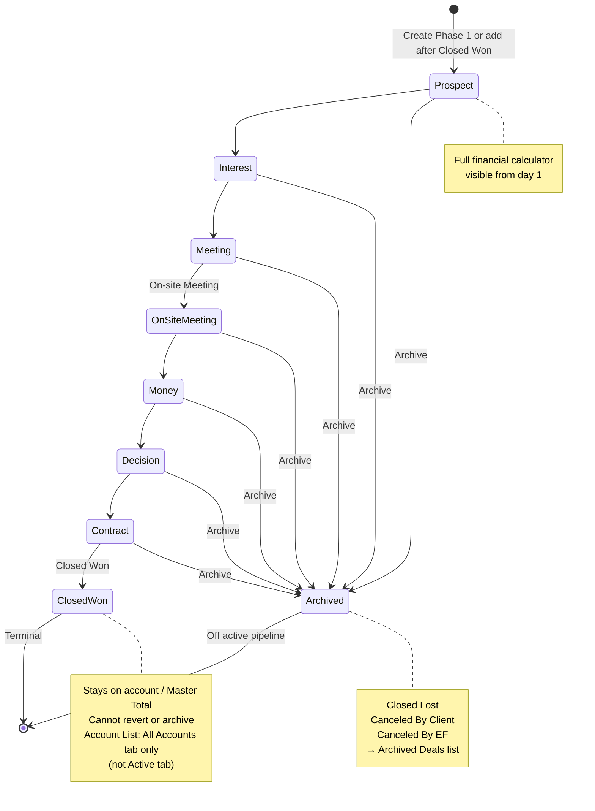
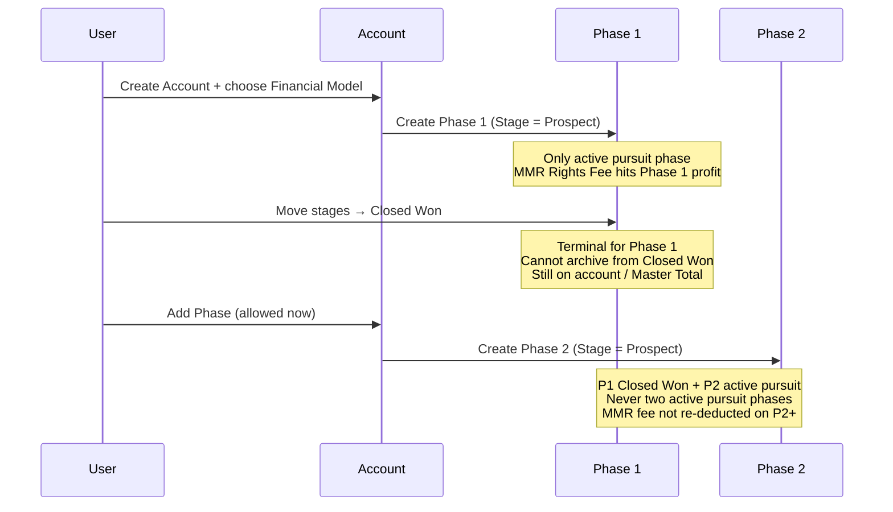
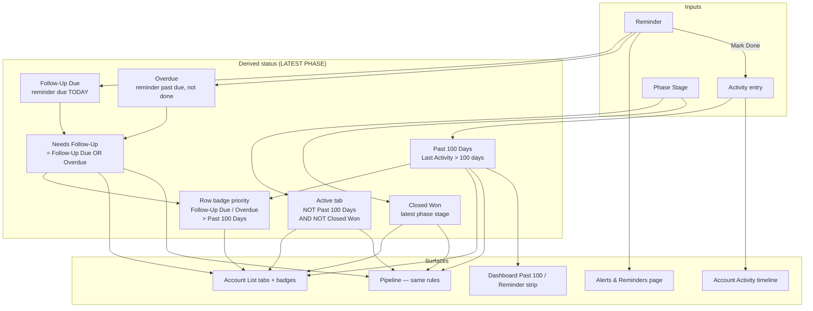
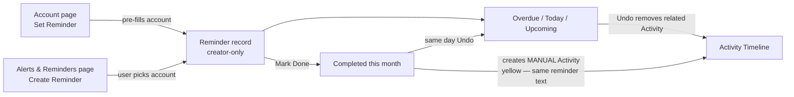
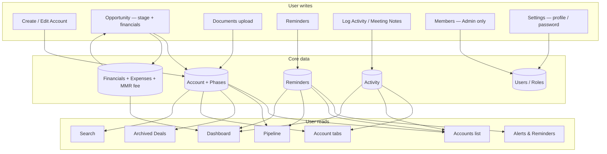
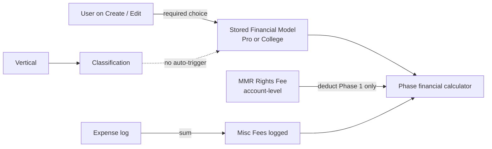

# Eternal Fan CRM — Flow & Interconnections

Clear picture of how the CRM connects (from `devhandoff.txt`, Figma, and client answers in `questions.txt`).

**Last aligned:** answers through **16-07-2026** in `questions.txt`.

---

## 0. One-screen mental model

```text
User (Admin / Standard)
    └── works in CRM screens
            ├── Dashboard          ← reads Account + Phase + Reminder + Activity
            ├── Accounts           ← list (filters/badges on LATEST phase; no nav counter)
            ├── Pipeline           ← same status rules as Accounts (LATEST phase)
            ├── Archived Deals     ← archived phases only (Closed Lost / Canceled *)
            ├── Alerts & Reminders ← creator-only reminders (+ due count in nav)
            ├── Search             ← global + results page
            ├── Members            ← Admin only (invite / remove)
            └── Settings           ← profile (initials avatar) + password

Account (one property / venue)
    ├── Contacts
    ├── Documents (Contracts per phase; MMR docs shared)
    ├── Activity timeline (system blue + MANUAL yellow)
    ├── Reminders (visible only to creator)
    └── Phases (max 5)  ← each has Stage + Financial calculator + % to Close
            └── only ONE active (non-closed) pursuit phase at a time
```

### Terminology (avoid mixing these up)

| Term | Meaning |
|------|---------|
| **Stage** | Editable pipeline field on a phase (Prospect → … → Closed Won, or archive reasons) |
| **Status** | Derived UI only — list tabs, row badges, Pipeline filters (not a separate DB field) |
| **Active tab** (Accounts/Pipeline) | Filter: NOT Past 100 Days AND NOT Closed Won (can include Needs Follow-Up) |
| **Active pursuit phase** | Only one phase at a time that is not Closed Won / not archived |
| **Active phase** (lifecycle) | Non-archived phase (Prospect through Closed Won) — includes Closed Won phases on the account |

---

## Module index (for team walkthroughs)

Jump to the numbered sections below for full detail.

| Module | See section | Key rules |
|--------|-------------|-----------|
| Auth & roles | **4** — Screen map | Admin vs Standard; no public sign-up |
| Members | **4** — Screen map | Admin invite/remove; hidden from Standard |
| Accounts list | **3** — Status & reminders | Tabs/badges on **latest** phase; filters parse address |
| Create / Edit account | **1** + **5** | Manual financial model; Places address; duplicate names blocked |
| Opportunity / Phases | **2** — Phase lifecycle | Max 5; Prospect start; one pursuit phase; Closed Won terminal |
| Financial calculator | **5** — Financial model | Pro vs College; Misc = expense sum; MMR fee on Phase 1 only |
| Documents / MMR | **1** — Domain map | MMR docs shared; Contracts per phase |
| Activity | **3** — Status & reminders | System blue vs manual yellow; reminder complete = manual |
| Reminders | **3** — Status & reminders | Creator-only; same feature from Account or Alerts page |
| Pipeline | **3** — Status & reminders | Same status rules as Accounts |
| Archived Deals | **2** — Phase lifecycle | Archived stages only |
| Dashboard | **3** + **4** | Past 100, reminder strip, top pursuits |
| Settings | **1** — Domain map | Initials avatar; password UI (no plain-text display) |

---

## 1. Domain map — how objects connect


### Rules (confirmed)

| Rule | Detail |
|------|--------|
| Account | One property (e.g. University of Arkansas); **duplicate names blocked** |
| Account Lead | **Internal** = CRM member dropdown; **External** = free-text consultant name |
| Phase | Follow-on engagement; hard max **5**; start at **Prospect** (no Unstarted) |
| Active pursuit phase | Only **one** non-closed phase at a time |
| Add Phase N | Only after previous phase is **Closed Won**; create account always starts at **Phase 1** |
| Financial Model | **Manual** on create/edit (Pro or College). **No** auto-logic from Classification (pivot **16-07-2026**) |
| Address | Single Google Places field; list filters (Country / State / Domestic) **parse from address** |
| Vendor address | Same pattern — **one** address input |
| Dropdowns | **Fixed** for v1 — client requests changes through dev |
| Misc Fees | Sum of expense log (no manual Misc field) |
| MMR docs | Shared across phases; **Contracts** have Associated Phase |
| MMR Rights Fee | **One-time, account-level**; deducted from **Phase 1** profit only (not later phases) |
| Avatar | Initials only (no profile photo upload) |
| Nav counters | Alerts may show due count; **Accounts has no counter** |
| Delete | **Admin only** (accounts, documents, etc.) |

---

## 2. Phase lifecycle (Stage state machine)

**Stage** is the sales pipeline field. **Status** badges/tabs are derived from stage + reminders + last activity (see §3).



### Multi-phase sequence



### Opportunity UI defaults

- Opening an account lands on **highest / most recently added** phase.
- Master Account Total shows when **2+ phases** exist; rollup = **non-archived** phases only (includes Closed Won).

---

## 3. Status, reminders & activity (cross-module)

Evaluated on the account’s **latest** phase unless noted.



### Account List / Pipeline status rules

| Tab / concept | Rule (on **latest** phase) |
|---------------|----------------------------|
| **All Accounts** | Latest phase is **not** archived (includes Closed Won) |
| **Active** | NOT Past 100 Days AND NOT Closed Won (includes Needs Follow-Up) |
| **Needs Follow-Up** | Follow-Up Due **OR** Overdue |
| **Past 100 Days** | Last activity more than 100 days ago |
| **Closed Won** | Latest phase stage = Closed Won; **All Accounts** tab only (not Active) |
| **Follow-Up Due** | Creator’s open reminder due **today** |
| **Overdue** | Creator’s open reminder past due |
| **Badge priority** | Follow-Up Due / Overdue **>** Past 100 Days |
| Pipeline | **Same** status rules as Accounts |

> Reminder-driven status uses the **creator’s** reminders (creator-only visibility). Other users do not see those reminders but status derivation follows the same rules for the account’s latest phase context.

### Reminder feature (one feature, two entry points)



| Reminder rule | Detail |
|---------------|--------|
| Same feature | Account pre-fills; Alerts page selects account |
| Visibility | **Creator only** — not shared with team |
| Completed list | **Current calendar month** only |
| Older completed | Hidden from Alerts after month; **still on Activity Timeline** (unless undone) |
| Undo | **Same day** as marked done; restores to due-date bucket |
| Activity on complete | Creates **manual** (yellow) Activity with **same string** as the reminder |
| Activity on undo | Related Activity entry is **removed** |

### What writes to Activity / Last Activity

| Auto (system blue) | Manual (brand yellow) |
|--------------------|------------------------|
| Meeting notes added | **Log Activity** button |
| Stage changes | **Reminder completions** (same reminder text) * |
| Document uploads (incl. MMR) | |
| Phase additions | |
| Contact additions | |

\* Reminder completion logging as **manual/yellow** confirmed **16-07-2026** (supersedes earlier “auto-log” wording).

`Last Activity` drives **Past 100 Days** (account / latest-phase evaluation).

---

## 4. Screen map — who reads / writes what



### Roles (quick)

| Role | Can |
|------|-----|
| **Admin** | Full access + permanent delete + **Members** page |
| **Standard** | Day-to-day CRM work; **no delete**; **no Members** page |

Members: Admin invite (email + role) → claim link / set password; remove member. No public sign-up. Confirmed **15-07-2026**.

---

## 5. Vertical, Classification & Financial Model



| Rule | Detail |
|------|--------|
| Vertical | Broad category (Sports, Lifestyle, …) — used for Classification cascade |
| Classification | Nested under Vertical (College Sports, Pro Football, …) — **does not** set financial model |
| Financial Model | User **must choose** Pro or College on create; **full control** regardless of Classification (**16-07-2026**) |
| Switching models | User may switch Pro ↔ College on edit; switching **to** College defaults Revenue Share % to **40%** |
| Schema | Always store Financial Model on the account (never derive-only from Classification) |

> **Pivot note:** Earlier answers described auto-trigger from Classification. Client confirmed **16-07-2026** that this is removed — manual selection only.

