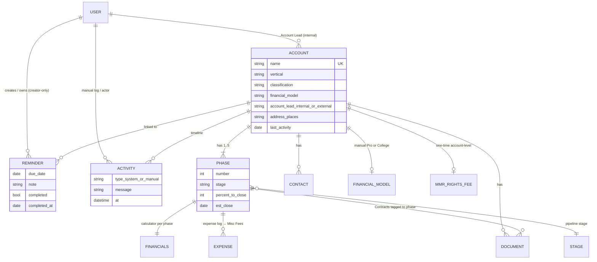
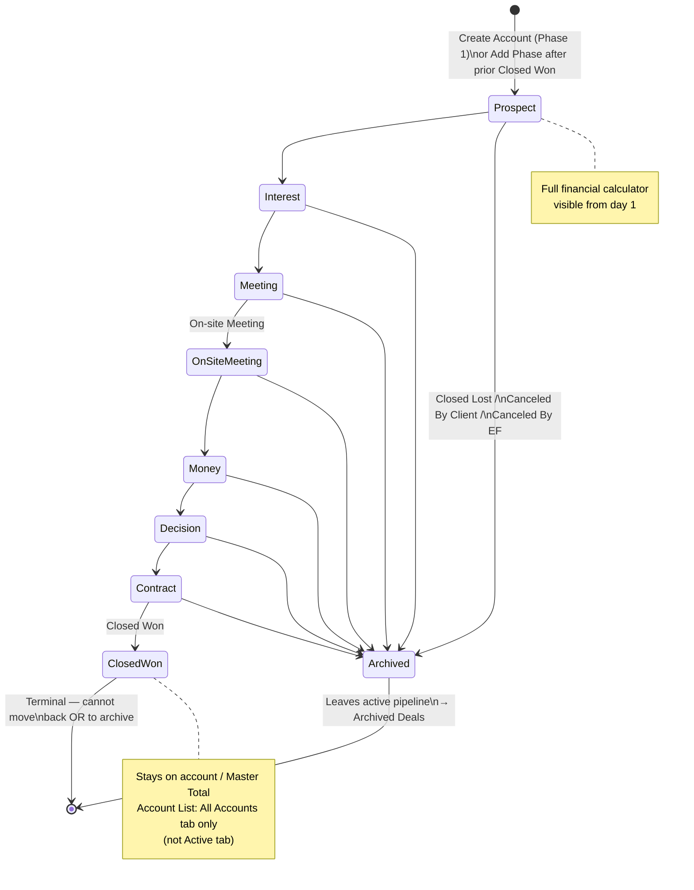
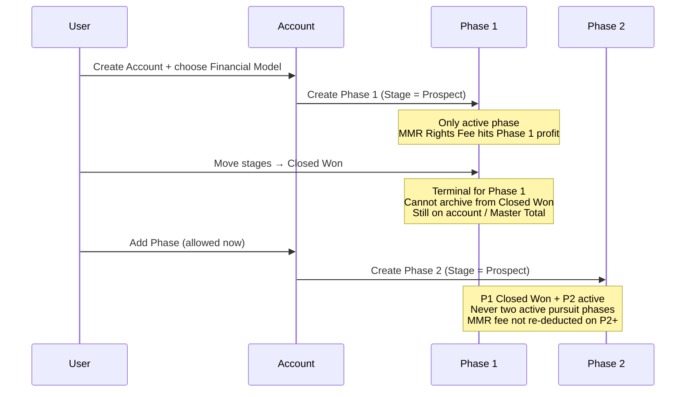
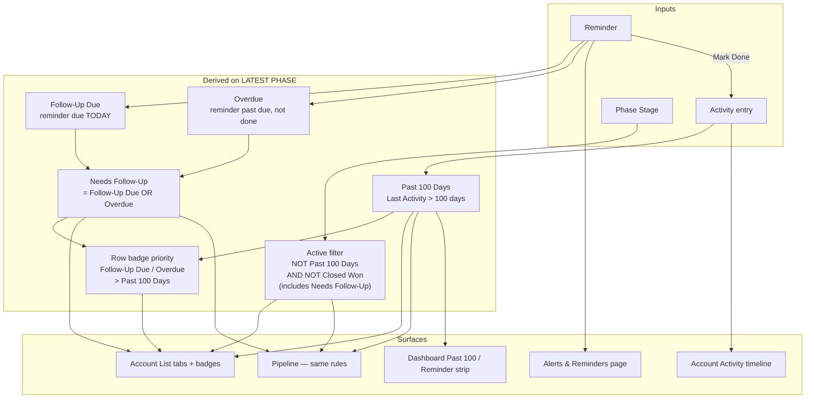
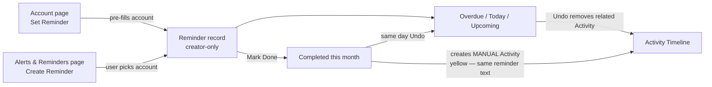
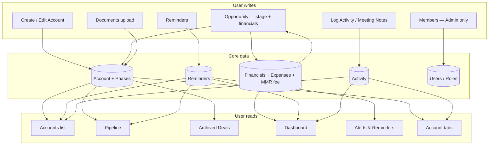
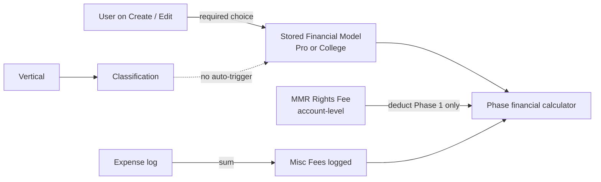

# Eternal Fan CRM — Flow & Interconnections

Clear picture of how the CRM connects (from `devhandoff.txt`, Figma, and client answers in `questions.txt`).

**How to view:** open this file in Cursor / GitHub / any Mermaid-capable preview.

**Last aligned:** answers through **16-07-2026** in `questions.txt`.

---

## 0. One-screen mental model

```text
User (Admin / Standard)
    └── works in CRM screens
            ├── Dashboard          ← reads Account + Phase + Reminder + Activity
            ├── Accounts           ← Account list (filters/badges on LATEST phase; no nav counter)
            ├── Pipeline           ← same status rules as Accounts (LATEST phase)
            ├── Archived Deals     ← archived phases only
            └── Alerts & Reminders ← Reminder tasks (creator-only; also create from Account)

Account (one property / venue)
    ├── Contacts
    ├── Documents (Contracts per phase; MMR docs shared)
    ├── Activity timeline (system blue + MANUAL yellow)
    ├── Reminders (visible only to creator)
    └── Phases (max 5)  ← each has Stage + Financial calculator + % to Close
            └── only ONE active (non-closed) phase at a time
```

---

## 1. Domain map — how objects connect



### Rules (confirmed)

| Rule | Detail |
|------|--------|
| Account | One property (e.g. University of Arkansas); **duplicate names blocked** |
| Phase | Follow-on engagement; hard max **5**; start at **Prospect** (no Unstarted) |
| Active phase | Only **one** non-closed phase at a time |
| Add Phase N | Only after previous phase is **Closed Won**; create account always starts at **Phase 1** |
| Financial Model | **Manual** on create/edit (Pro or College). **No** auto-logic from Classification |
| Address | Single Google Places field; list filters (Country / State / Domestic) **parse from address** |
| Vendor address | Same pattern — **one** address input |
| Misc Fees | Sum of expense log (no manual Misc field) |
| MMR docs | Shared across phases; **Contracts** have Associated Phase |
| MMR Rights Fee | **One-time, account-level**; deducted from **Phase 1** profit only (not later phases) |
| Avatar | Initials only (no profile photo upload) |
| Nav | Alerts may show due count; **Accounts has no counter** |

---

## 2. Phase lifecycle (Stage state machine)



### Multi-phase sequence



### Opportunity UI defaults

- Opening an account lands on **highest / most recently added** phase.
- Master Account Total shows when **2+ phases** exist; rollup = **non-archived** phases only (includes Closed Won).

---

## 3. Status, reminders & activity (cross-module)

This is where Accounts, Pipeline, Alerts, Activity, and Dashboard meet.



### Account List / Pipeline status rules

| Tab / concept | Rule (on **latest** phase) |
|---------------|----------------------------|
| **All Accounts** | Latest phase is **not** archived (includes Closed Won) |
| **Active** | NOT Past 100 Days AND NOT Closed Won (includes Needs Follow-Up) |
| **Needs Follow-Up** | Follow-Up Due **OR** Overdue |
| **Past 100 Days** | Last activity more than 100 days ago |
| **Closed Won** | Shown under **All Accounts** only (not Active) |
| **Follow-Up Due** | Reminder due **today** |
| **Overdue** | Reminder past due, not completed |
| **Badge priority** | Follow-Up Due / Overdue **>** Past 100 Days |
| Pipeline | **Same** status rules; evaluated on account’s **latest** phase |

### Reminder feature (one feature, two entry points)



| Reminder rule | Detail |
|---------------|--------|
| Same feature | Account pre-fills; Alerts page selects account |
| Visibility | **Creator only** — not shared with team |
| Completed list | **Current calendar month** only |
| Older completed | Leave Alerts “Completed this month”; remain on **Activity Timeline** (unless undone) |
| Undo | **Same day** as marked done; restores to due-date bucket |
| Activity on complete | Creates **manual** (yellow) Activity with **same string** as the reminder |
| Activity on undo | Related Activity entry is **removed** |

### What writes to Activity / Last Activity

| Auto (system blue) | Manual (brand yellow) |
|--------------------|------------------------|
| Meeting notes added | **Log Activity** button |
| Stage changes | **Reminder completions** (same reminder text) |
| Document uploads (incl. MMR) | |
| Phase additions | |
| Contact additions | |

`Last Activity` drives **Past 100 Days** (account / latest-phase evaluation per client).

---

## 4. Screen map — who reads / writes what



### Roles (quick)

| Role | Can |
|------|-----|
| **Admin** | Full access + permanent delete + Members page |
| **Standard** | Day-to-day CRM work; **no delete** |

Members: Admin invite (email + role) → claim link / set password; remove member. No public sign-up. Confirmed **15-07-2026**.

---

## 5. Vertical, Classification & Financial Model



| Rule | Detail |
|------|--------|
| Vertical | Broad category (Sports, Lifestyle, …) |
| Classification | Nested under Vertical (College Sports, Pro Football, …) |
| Financial Model | User **must specify** Pro or College on create; **full control** regardless of Classification |
| Switching models | Allowed on edit; when moving to College, Revenue Share % defaults to **40%** (same as new college deal) |
| Schema | Always store Financial Model on the account (do not derive-only from Classification) |

---

## 6. Open items that still affect these flows

Track in `questions.txt` — do not invent in code:

1. **Revenue Share %** — client said “typically 40%”; confirm if always editable per deal after default  
2. **MMR Rights Fee UI placement** — fee is account-level / Phase 1 profit; confirm edit surface (account field vs Phase 1 calculator only; Phase 2+ read-only or hidden)

Everything else in §6 of the prior FLOW (reminder visibility, Needs Follow-Up OR, badge priority, Closed Won tabs/archive, classification auto-model) is **resolved** — see above.

---

## Related docs

| Doc | Purpose |
|-----|---------|
| `devhandoff.txt` | Business + financial formulas |
| `questions.txt` | Client Q&A (incl. 15-07 / 16-07 answers) |
| `PLAN.md` | Build phases / stack |
| `estimation/Eternal-Fan-CRM-Timeline.xlsx` | Timeline for team |
